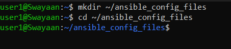
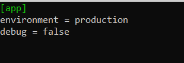
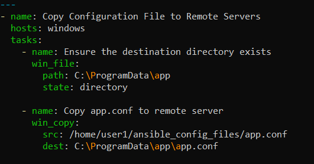
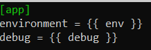
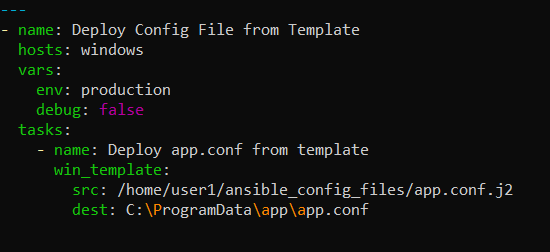
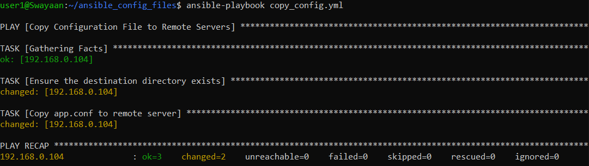
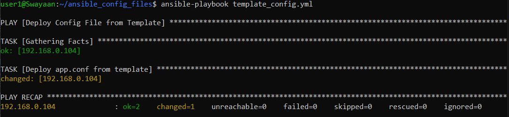

# Ansible Playbook to Manage Configuration Files on Multiple Servers

## Table of Contents
1. [Introduction](#introduction)
2. [Problem Statement](#problem-statement)
3. [Prerequisites](#prerequisites)
   - [Software Required](#software-required)
   - [Hardware Requirement](#hardware-requirement)
4. [Writing the Ansible Playbook for Configuration Management](#writing-the-ansible-playbook-for-configuration-management)
   - [Copying Configuration Files](#copying-configuration-files)
   - [Managing Configuration Files with Templates](#managing-configuration-files-with-templates)
5. [Running the Playbook](#running-the-playbook)
6. [Verifying Configuration Changes](#verifying-configuration-changes)
7. [Supported Reference](#supported-reference)

---

## Introduction

Managing configuration files on multiple remote servers is crucial for consistent system behavior across environments. Ansible simplifies this by allowing you to automate the copying, templating, and modification of configuration files across servers. In this guide, we will use Ansible to manage configuration files for multiple servers, ensuring that these files are identical and customized where necessary.

---

## Problem Statement

Manually updating configuration files on multiple servers is time-consuming and error-prone. Using Ansible, you can automate this process by defining the configuration files centrally and ensuring all target servers maintain the desired configuration.

In this guide, we'll demonstrate how to copy configuration files and use Jinja2 templates to manage configurations with dynamic content.

---

## Prerequisites
Completion of all previous lab guides (up to Lab Guide-02) is required before proceeding with Lab Guide-03.

Before proceeding, ensure that you have the following setup completed:

### Software Required
- **Windows Subsystem for Linux (WSL)**: Installed on your control node.
- **Python 3.8 or later**: Installed on your WSL environment.
- **Ansible 2.9 or later**: Installed and configured.
- **Windows or Linux Remote Servers**: Target servers where configuration files will be managed.

### Hardware Requirement
- **Control Node**: A Windows machine with WSL enabled.
- **Target Nodes**: Remote Windows or Linux machines that Ansible will manage.

---

## Writing the Ansible Playbook for Configuration Management

### Copying Configuration Files

We will begin by writing a playbook that copies static configuration files from the control node to remote servers. For this example, we will copy an `app.conf` file to multiple servers.

### Step 1: Create the Configuration File

1. In your WSL environment, create a directory for storing the configuration files:

   ```bash
   mkdir ~/ansible_config_files
   cd ~/ansible_config_files
   ```

   

2. Create a sample configuration file named `app.conf`:

   ```bash
   nano app.conf
   ```

3. Add the following content to the `app.conf` file:

   ```ini
   [app]
   environment = production
   debug = false
   ```

   

### Step 2: Write the Playbook to Copy Configuration Files

1. Create a new file named `copy_config.yml` in the same directory:
   ```bash
   nano copy_config.yml
   ```

2. Add the following YAML content to define the playbook:

   ```yaml
   ---
   - name: Copy Configuration File to Remote Servers
     hosts: windows
     tasks:
       - name: Ensure the destination directory exists
         win_file:
           path: C:\ProgramData\app
           state: directory
   
       - name: Copy app.conf to remote server
         win_copy:
           src: /home/user1/ansible_config_files/app.conf
           dest: C:\ProgramData\app\app.conf
   ```

   

   This playbook does the following:
   - **name**: Describes the task ("Copy Configuration File to Remote Servers").
   - **hosts**: Specifies the group of remote machines to target (in this case, `windows`).
   - **tasks**: Lists the tasks to execute. Here, we are using the `win_copy` Ansible module to copy the `app.conf` file to the specified destination on the remote servers.
   - In the `src` field of your Ansible playbooks, you should provide the username of the host system (the control node where you are running Ansible) when specifying the file path.

---

### Managing Configuration Files with Templates

Sometimes, configuration files need to contain dynamic values that vary between servers. Ansible’s templating system, using Jinja2, allows for the generation of configuration files with server-specific content.

### Step 1: Create the Template

1. Create a Jinja2 template file named `app.conf.j2`:

   ```bash
   nano app.conf.j2
   ```

2. Add the following content to the template file:

   ```ini
   [app]
   environment = {{ env }}
   debug = {{ debug }}
   ```

   

   This template allows for dynamic insertion of values for the `environment` and `debug` fields.

### Step 2: Write the Playbook to Manage Configuration Files

1. Create a new file named `template_config.yml`:

   ```bash
   nano template_config.yml
   ```

2. Add the following YAML content to define the playbook:


   ```yaml
   ---
   - name: Deploy Config File from Template
     hosts: windows
     vars:
       env: production
       debug: false
     tasks:
       - name: Deploy app.conf from template
         win_template:
           src: /home/<your_username>/ansible_config_files/app.conf.j2
           dest: C:\ProgramData\app\app.conf
   ```

   

   This playbook does the following:
   - **name**: Describes the task ("Deploy Config File from Template").
   - **vars**: Defines the variables `env` and `debug` that will be used in the template.
   - **tasks**: Uses the `win_template` module to copy the dynamically generated configuration file to the target servers.
   - In the `src` field of your Ansible playbooks, you should provide the username of the host system (the control node where you are running Ansible) when specifying the file path.

---

## Running the Playbook

### Step 1: Execute the Playbook

You can now run the playbook to copy or generate configuration files on remote servers.

For copying the static configuration file, run:

```bash
ansible-playbook copy_config.yml
```

For generating and deploying the configuration file from a template, run:

```bash
ansible-playbook template_config.yml
```

### Step 2: Verify the Output

After running the playbook, you should see output similar to the following, indicating that Ansible has connected to the remote servers and executed the tasks:





The `ok=1` indicates that the task has successfully executed. If the configuration file was changed or copied, `changed=1` will appear instead.

---

## Verifying Configuration Changes

To verify that the configuration files have been successfully copied or modified:

### Step 1: Check the Configuration on Remote Servers

1. Log in to the remote Windows or Linux machine.
2. Navigate to the destination directory (e.g., `C:\ProgramData\app\`).
3. Verify the contents of the `app.conf` file:

   ```bash
   type C:\ProgramData\app\app.conf
   ```

   

   The output should match the content from the source file or template.

---

## Supported Reference

For more detailed references on Ansible for managing configuration files, visit:

- [Ansible Documentation](https://docs.ansible.com/)
- [Jinja2 Templating Documentation](https://jinja.palletsprojects.com/en/2.11.x/templates/)
