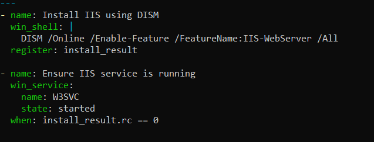
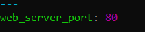
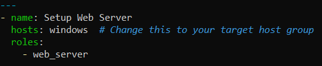
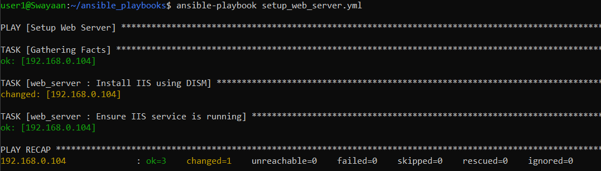
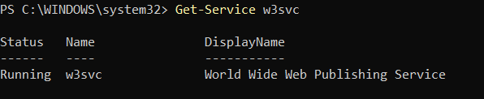
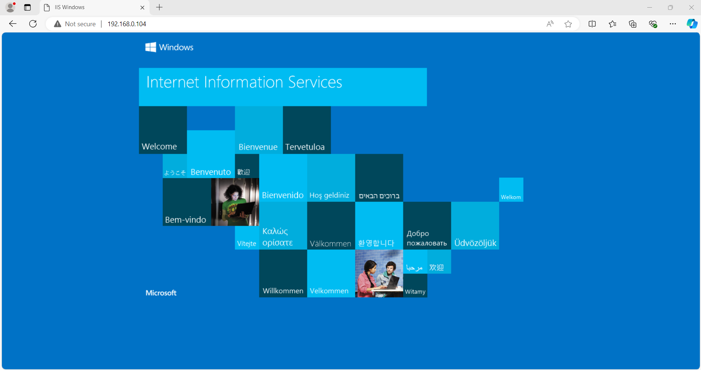

# Implementing Ansible Roles to Organize Playbooks and Tasks

## Table of Contents
1. [Introduction](#introduction)
2. [Problem Statement](#problem-statement)
3. [Prerequisites](#prerequisites)
   - [Software Required](#software-required)
   - [Hardware Requirement](#hardware-requirement)
4. [Creating an Ansible Role](#creating-an-ansible-role)
   - [Directory Structure](#directory-structure)
   - [Creating Tasks](#creating-tasks)
   - [Creating Defaults and Variables](#creating-defaults-and-variables)
5. [Using the Role in a Playbook](#using-the-role-in-a-playbook)
6. [Running the Playbook](#running-the-playbook)
7. [Verifying the Role Execution](#verifying-the-role-execution)
8. [Supported Reference](#supported-reference)

---

## Introduction

Ansible roles allow you to organize your playbooks and tasks into reusable components. This modular approach makes it easier to manage complex configurations, share code, and maintain clarity in your automation scripts. Roles can contain variables, tasks, handlers, and templates, all in a standardized directory structure.

---

## Problem Statement

As your automation needs grow, managing playbooks and tasks in a single file can become unwieldy and difficult to maintain. Ansible roles provide a way to break down your automation tasks into smaller, more manageable units, making it easier to understand, reuse, and share your code.

In this guide, we will create an Ansible role to manage a specific task (e.g., installing and configuring a web server) and then use that role in a playbook.

---

## Prerequisites
Completion of all previous lab guides (up to Lab Guide-03) is required before proceeding with Lab Guide-04.

Before proceeding, ensure that you have the following setup completed:

### Software Required
- **Windows Subsystem for Linux (WSL)**: Installed on your control node.
- **Python 3.8 or later**: Installed on your WSL environment.
- **Ansible 2.9 or later**: Installed and configured.

### Hardware Requirement
- **Control Node**: A Windows machine with WSL enabled.
- **Target Nodes**: Remote Windows or Linux machines that Ansible will manage.

---

## Creating an Ansible Role

### Step 1: Create the Role

1. In your WSL environment, navigate to your Ansible playbooks directory:

   ```bash
   cd ~/ansible_playbooks
   ```

### Directory Structure

* The directory structure for roles is essential to creating a new role, such as:

  * **`Role Structure`**:The roles have a structured layout on the file system. You can change the default structured of the roles as well.

**For example**, let us stick to the default structure of the roles.

* The `web_server` directory will contain the following structure:

```
web_server/
├── tasks/
│   └── main.yml
├── handlers/
│   └── main.yml
├── templates/
├── files/
├── vars/
│   └── main.yml
└── defaults/
    └── main.yml
```

### Step 2: Creating Tasks

1. Open the `tasks/main.yml` file:

   ```bash
   nano web_server/tasks/main.yml
   ```

2. Add the following content to install and configure a web server (IIS for Windows):

   ```yaml
   ---
   - name: Install IIS using DISM
     win_shell: |
       DISM /Online /Enable-Feature /FeatureName:IIS-WebServer /All
     register: install_result
   
   - name: Ensure IIS service is running
     win_service:
       name: W3SVC
       state: started  # Change 'running' to 'started'
     when: install_result.rc == 0
   ```

   

   **In this task:**

    - The win_feature module is used to install IIS.
    - The win_service module is used to ensure the IIS service is started and enabled.

### Step 3: Creating Defaults and Variables

1. Open the `defaults/main.yml` file:
   ```bash
   nano web_server/defaults/main.yml
   ```

2. Add default variables for the role:
   ```yaml
   ---
   web_server_port: 80
   ```

   

3. (Optional) If you have specific variables to pass, you can create `vars/main.yml` to define those.

---

## Using the Role in a Playbook

Now that the role is created, we can use it in a playbook.

### Step 1: Create a Playbook

1. Create a new file named `setup_web_server.yml` in your playbooks directory:
   ```bash
   nano setup_web_server.yml
   ```

2. Add the following content to use the `web_server` role:

   ```yaml
   ---
   - name: Setup Web Server
     hosts: windows  # Change this to your target host group
     roles:
       - web_server
   ```

   

---

## Running the Playbook

Now that the role is set up and the playbook is written, you can run the playbook to apply the role:

### Step 1: Execute the Playbook

Run the following command to execute the `setup_web_server.yml` playbook:

```bash
ansible-playbook setup_web_server.yml
```



### Step 2: Verify the Output

You should see output indicating that Ansible has connected to the remote servers and executed the tasks defined in the role.

---

## Verifying the Role Execution

To verify that the web server has been installed and configured correctly:

### Step 1: Check the Web Server

1. Log in to the remote server.
2. Verify the web server status:

   - For IIS (Windows):
     ```powershell
     Get-Service w3svc
     ```

   

### Step 2: Access the Web Server

Open a web browser and navigate to the server’s IP address. You should see the default page of the installed web server.



---

## Supported Reference

For more detailed references on Ansible roles, visit:

- [Ansible Documentation](https://docs.ansible.com/)
- [Ansible Roles Documentation](https://docs.ansible.com/ansible/latest/user_guide/playbooks_reuse.html)

---