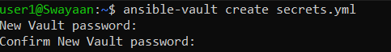
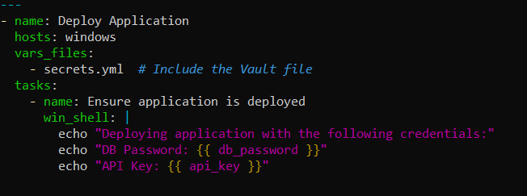
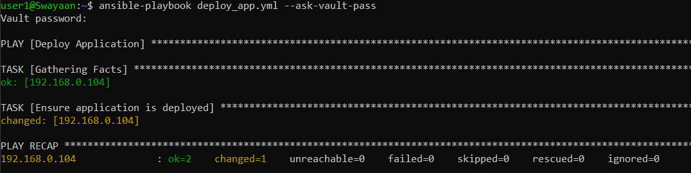

# Using Ansible Vault to Securely Store Sensitive Data

## Table of Contents

1. [Introduction](#introduction)
2. [Problem Statement](#problem-statement)
3. [Prerequisites](#prerequisites)
   - [Software Required](#software-required)
   - [Hardware Requirement](#hardware-requirement)
4. [Creating an Ansible Vault File](#creating-an-ansible-vault-file)
5. [Using Vault Data in Playbooks](#using-vault-data-in-playbooks)
6. [Encrypting and Decrypting Vault Files](#encrypting-and-decrypting-vault-files)
7. [Running Playbooks with Vault](#running-playbooks-with-vault)
8. [Supported Reference](#supported-reference)

---

## Introduction

Ansible Vault is a feature that allows you to encrypt sensitive data, such as passwords or API keys, and store them securely within your Ansible project. By using Vault, you can ensure that sensitive information is protected while still allowing it to be easily accessed in your playbooks.

---

## Problem Statement

Storing sensitive data in plain text within playbooks or inventory files poses a significant security risk. If unauthorized users gain access to these files, they can misuse the information. Ansible Vault helps mitigate this risk by encrypting sensitive data, ensuring that only authorized users can access it.

---

## Prerequisites
Completion of all previous lab guides (up to Lab Guide-04) is required before proceeding with Lab Guide-05.

Before proceeding, ensure that you have the following setup completed:

### Software Required

- **Windows Subsystem for Linux (WSL)**: Installed on your control node.
- **Python 3.8 or later**: Installed on your WSL environment.
- **Ansible 2.9 or later**: Installed and configured.

### Hardware Requirement

- **Control Node**: A Windows machine with WSL enabled.
- **Target Nodes**: Remote Windows or Linux machines that Ansible will manage.

---

## Creating an Ansible Vault File

### Step 1: Create a Vault File

To create an encrypted file, use the following command:

```bash
ansible-vault create secrets.yml
```

Add `new password` for your vault



This command will open a text editor. You can add your sensitive data in YAML format, for example:

```yaml
db_password: P@ssw0rd123
api_key: ABCD1234EFGH5678
```

### Step 2: Save and Exit

After entering your sensitive data, save the file and exit the editor. The contents will now be encrypted.

---

## Using Vault Data in Playbooks

You can use the data stored in the Vault file in your playbooks by referencing the variables defined in the Vault. Here’s an example playbook:

### Step 1: Create a Playbook

Create a new file named `deploy_app.yml`:

```bash
nano deploy_app.yml
```

### Step 2: Add the Following Content

```yaml
---
- name: Deploy Application
  hosts: windows
  vars_files:
    - secrets.yml  # Include the Vault file
  tasks:
    - name: Ensure application is deployed
      win_shell: |
        echo "Deploying application with the following credentials:"
        echo "DB Password: {{ db_password }}"
        echo "API Key: {{ api_key }}"
```



In this example, the `vars_files` directive is used to include the encrypted `secrets.yml` file.

---

## Encrypting and Decrypting Vault Files

### Encrypting a Plain Text File

If you have a plain text file that you want to encrypt, use:

```bash
ansible-vault encrypt myfile.yml
```

### Decrypting a Vault File

To decrypt a previously encrypted file, use:

```bash
ansible-vault decrypt secrets.yml
```

### Editing an Encrypted Vault File

If you need to edit the Vault file, use:

```bash
ansible-vault edit secrets.yml
```

You will be prompted for the Vault password to access the file.

---

## Running Playbooks with Vault

When running playbooks that use Vault-encrypted files, you need to provide the Vault password:

### Prompt for Password

When executing the playbook, you can prompt for the Vault password:

```bash
ansible-playbook deploy_app.yml --ask-vault-pass
```



---

## Supported Reference

For more detailed references on Ansible Vault, visit:

- [Ansible Vault Documentation](https://docs.ansible.com/ansible/latest/user_guide/vault.html)
- [Ansible Documentation](https://docs.ansible.com/)

---