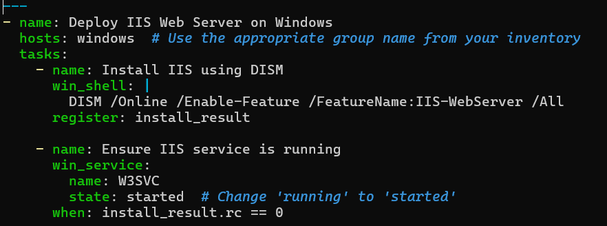
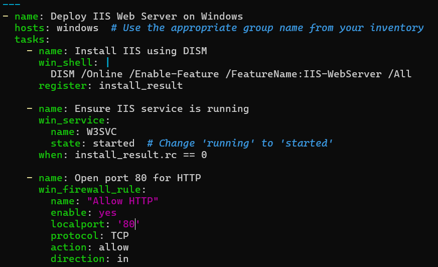
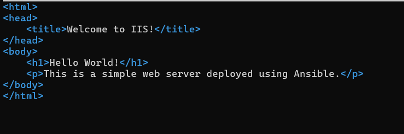
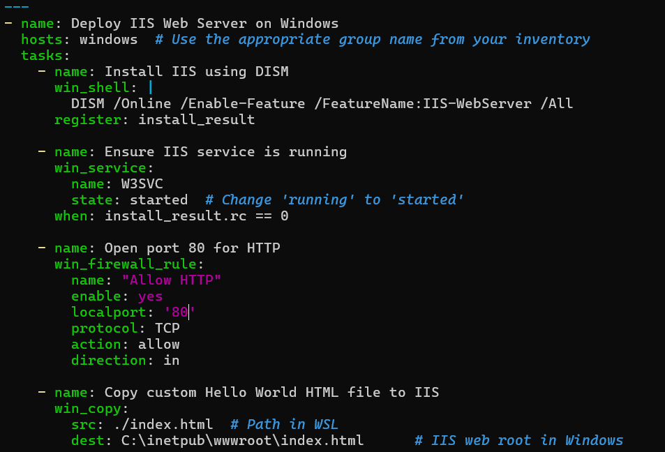
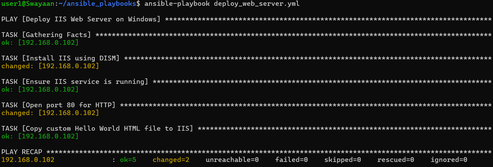
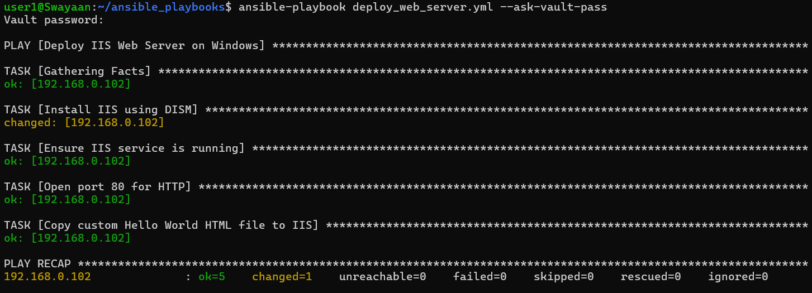
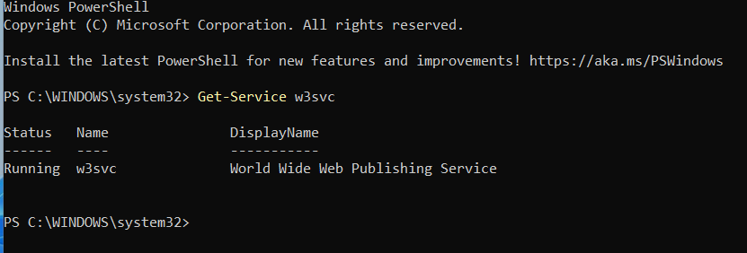
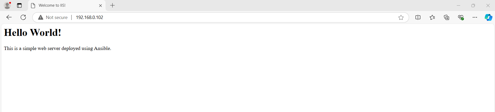

# Automating the Deployment of a Web Server on Windows Using Ansible Playbooks

## Table of Contents

1. [Introduction](#introduction)
2. [Problem Statement](#problem-statement)
3. [Prerequisites](#prerequisites)
   - [Software Required](#software-required)
   - [Hardware Requirements](#hardware-requirements)
4. [Creating the Ansible Playbook](#creating-the-ansible-playbook)
   - [Installing IIS Web Server](#step-1-installing-iis-web-server)
   - [Setting Up Firewall Rules](#step-2-setting-up-firewall-rules)
   - [Configuring the Web Server](#step-3-configuring-the-web-server)
   - [Full Playbook YAML](#step-4-full-playbook-yaml)
5. [Executing the Playbook](#executing-the-playbook)
6. [Verifying Web Server Deployment](#verifying-web-server-deployment)
7. [Supported References](#supported-references)

---

## Introduction

Ansible simplifies the automation of web server deployments across multiple Windows servers, ensuring consistency and reducing manual configuration. In this guide, we'll create an Ansible playbook to automate the installation and configuration of IIS (Internet Information Services), a web server for Windows systems.

---

## Problem Statement

Manually deploying web servers across multiple Windows systems can be time-consuming and error-prone. Automating this process using Ansible ensures uniformity, allows repeatable processes, and speeds up the deployment.

---

## Prerequisites
Completion of all previous lab guides (up to Lab Guide-05) is required before proceeding with Lab Guide-06.

Before you begin, make sure you have the following setup:

### Software Required

- **Windows Subsystem for Linux (WSL)**: Installed on your control node.
- **Ansible 2.9 or later**: Installed and configured in the WSL environment.
- **WinRM**: Configured and running on the target Windows machines to allow remote management.

### Hardware Requirements

- **Control Node**: A Windows machine with WSL and Ansible installed.
- **Target Node(s)**: Remote Windows machines where the IIS web server will be deployed.

**WinRM Setup on Windows Target Machines:**

To configure WinRM on Windows:

```bash
winrm quickconfig
winrm set winrm/config/service/auth '@{Basic="true"}'
```

---

## Creating the Ansible Playbook

### Step 1: Installing IIS Web Server

1. Navigate to your playbooks directory:
   ```bash
   cd ~/ansible_playbooks
   ```

2. Create a new playbook file named `deploy_web_server.yml`:
   ```bash
   nano deploy_web_server.yml
   ```

3. Add the following content to install IIS (Internet Information Services) on the target Windows servers:

   ```yaml
   - name: Deploy IIS Web Server on Windows
     hosts: windows
     tasks:
       - name: Install IIS using DISM 
         win_shell: | 
           DISM /Online /Enable-Feature /FeatureName:IIS-WebServer /All 
         register: install_result
   
       - name: Ensure IIS service is running
         win_service:
           name: W3SVC
           state: started
         when: install_result.rc == 0
   ```

   

In this section:
- The `win_feature` module installs IIS.
- The `win_service` module ensures that IIS is running and starts automatically.

### Step 2: Setting Up Firewall Rules

To ensure IIS can be accessed, you need to add firewall rules:

1. Add the following task to open port 80 (HTTP):

   ```yaml
       - name: Open port 80 for HTTP
         win_firewall_rule:
           name: "Allow HTTP"
           enable: yes
           localport: '80'
           protocol: TCP
           action: allow
           direction: in
   ```

   

This rule ensures that incoming HTTP traffic is allowed on the server.

### Step 3: Configuring the Web Server

We will now replace the default IIS welcome page with a simple "Hello World" HTML page.

1. First, create a local `index.html` file:

   ```bash
   nano ~/ansible_playbooks/index.html
   ```

2. Add the following content to the HTML file:

   ```html
   <html>
   <head>
       <title>Welcome to IIS!</title>
   </head>
   <body>
       <h1>Hello World!</h1>
       <p>This is a simple web server deployed using Ansible.</p>
   </body>
   </html>
   ```

      

3. Add a task in the playbook to copy this file to the target Windows machine:

   ```yaml
       - name: Copy custom Hello World HTML file to IIS
         win_copy:
           src: ./index.html  # Path in WSL
           dest: C:\inetpub\wwwroot\index.html      # IIS web root in Windows
   ```

   

This task replaces the default IIS homepage with your custom "Hello World" page.

---

### Step 4: Full Playbook YAML

Here’s the complete `deploy_web_server.yml` file:

```yaml
---
- name: Deploy IIS Web Server on Windows
  hosts: windows
  tasks:
    - name: Install IIS using DISM 
      win_shell: | 
        DISM /Online /Enable-Feature /FeatureName:IIS-WebServer /All 
      register: install_result

    - name: Ensure IIS service is running
      win_service:
        name: W3SVC
        state: started
      when: install_result.rc == 0

    - name: Open port 80 for HTTP
      win_firewall_rule:
        name: "Allow HTTP"
        enable: yes
        localport: '80'
        protocol: TCP
        action: allow
        direction: in

    - name: Copy custom Hello World HTML file to IIS
      win_copy:
        src: ./index.html # make sure your file is in runnning directory
        dest: C:\inetpub\wwwroot\index.html
```

---

## Executing the Playbook

Once your playbook is ready, you can execute it to deploy the IIS web server on the remote Windows systems.

### Step 1: Run the Playbook

Run the playbook using the following command:

```bash
ansible-playbook deploy_web_server.yml
```



### Step 2: Provide Vault Password (if using)

If you are using Ansible Vault to manage sensitive data (e.g., passwords for connecting to the Windows hosts), add the following flag to the command:

```bash
ansible-playbook deploy_web_server.yml --ask-vault-pass
```



---

## Verifying Web Server Deployment

### Step 1: Check the IIS Service

After the playbook execution, verify that the IIS service is running on the target servers:

1. Log in to one of the remote Windows machines.
2. Open PowerShell as Administrator and run the following command:

   ```powershell
   Get-Service W3SVC
   ```

   

This command will display the status of the IIS service (W3SVC). Ensure that it is running.

### Step 2: Verify Web Access

To verify that the web server is running and accessible:

1. Open a web browser.
2. Navigate to `http://<target-machine-ip>`.



If the deployment was successful, you should see either the default IIS welcome page or your custom page (if you deployed one).

---

## Supported References

For more information on automating Windows systems with Ansible, refer to:

- [Ansible Windows Documentation](https://docs.ansible.com/ansible/latest/user_guide/windows.html)
- [Ansible Modules for Windows](https://docs.ansible.com/ansible/latest/collections/ansible/windows/index.html)
- [IIS Documentation](https://docs.microsoft.com/en-us/iis/)

---