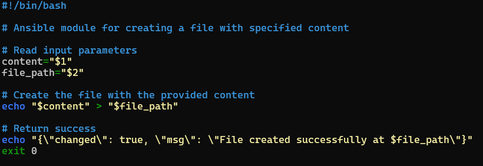
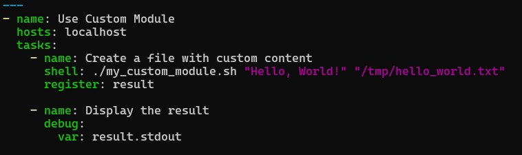
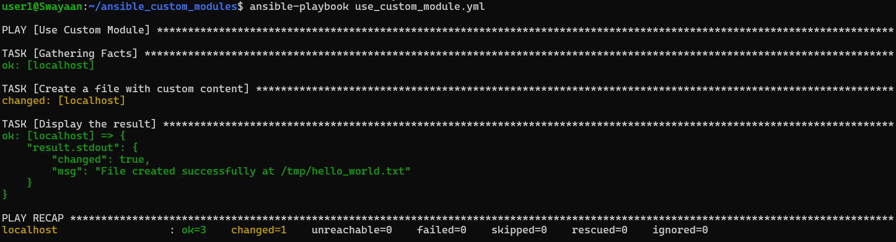
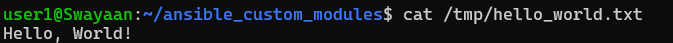

# Creating a Custom Module in Ansible and Integrating It into a Playbook

## Table of Contents

1. [Introduction](#introduction)
2. [Problem Statement](#problem-statement)
3. [Prerequisites](#prerequisites)
   - [Software Requirements](#software-requirements)
4. [Step-by-Step Guide to Creating a Custom Module](#step-by-step-guide-to-creating-a-custom-module)
   - [Step 1: Create the Custom Module](#step-1-create-the-custom-module)
   - [Step 2: Create a Playbook to Use the Custom Module](#step-2-create-a-playbook-to-use-the-custom-module)
   - [Step 3: Execute the Playbook](#step-3-execute-the-playbook)
5. [Verifying the Module Execution](#verifying-the-module-execution)
6. [Supported References](#supported-references)

---

## Introduction

Ansible allows users to extend its functionality by creating custom modules. These modules can be written in various programming languages, including Bash. This guide will walk you through creating a simple Bash custom module and integrating it into an Ansible playbook.

> **Note: What is a Custom Module?**
>
>       A custom module in Ansible is a reusable piece of code that can perform specific tasks on managed hosts. You can create custom modules to meet specific requirements that are not covered by existing Ansible modules.

---

## Problem Statement

While Ansible provides many built-in modules for various tasks, there may be scenarios where you need functionality that is not available. Creating custom modules allows you to tailor Ansible to fit your specific automation needs.

---

## Prerequisites
Completion of all previous lab guides (up to Lab Guide-08) is required before proceeding with Lab Guide-09.

### Software Requirements
- **Ansible 2.9+**: Installed on your control node (WSL for Windows users).
- **WSL (Windows Subsystem for Linux)**: If using Windows as your control node.
- **Bash**: Basic understanding of Bash scripting.

---

## Step-by-Step Guide to Creating a Custom Module

### Step 1: Create the Custom Module

1. **Create a Directory for Your Module**:

   - Navigate to your Ansible project directory:

   ```bash
   mkdir -p ~/ansible_custom_modules
   cd ~/ansible_custom_modules
   ```

2. **Create the Custom Module File**:

   - Create a new Bash script named `my_custom_module.sh`:

   ```bash
   nano my_custom_module.sh
   ```

3. **Add the Following Content to the Script**:

   ```bash
   #!/bin/bash

   # Ansible module for creating a file with specified content

   # Read input parameters
   content="$1"
   file_path="$2"

   # Create the file with the provided content
   echo "$content" > "$file_path"

   # Return success
   echo "{\"changed\": true, \"msg\": \"File created successfully at $file_path\"}"
   exit 0
   ```

   

   This script takes two parameters: the content to write to the file and the file path where it should be created.

4. **Make the Module Executable**:

   - Run the following command to make the script executable:

   ```bash
   chmod +x my_custom_module.sh
   ```

   

---

### Step 2: Create a Playbook to Use the Custom Module

1. **Create a Playbook File**:

   - Create a new playbook named `use_custom_module.yml`:

   ```bash
   nano use_custom_module.yml
   ```

2. **Add the Following Content to the Playbook**:

   ```yaml
   ---
   - name: Use Custom Module
     hosts: localhost
     tasks:
       - name: Create a file with custom content
         shell: ./my_custom_module.sh "Hello, World!" "/tmp/hello_world.txt"
         register: result

       - name: Display the result
         debug:
           var: result.stdout
   ```

   

   This playbook will execute the custom module to create a file with the specified content.

---

### Step 3: Execute the Playbook

1. **Run the Playbook**:

   - Execute the playbook using the following command:

   ```bash
   ansible-playbook use_custom_module.yml
   ```

   

   You should see output indicating that the file was created successfully.

---

## Verifying the Module Execution

1. **Check the Created File**:
   - Verify that the file was created by checking the content:

   ```bash
   cat /tmp/hello_world.txt
   ```

   

   You should see "Hello, World!" in the output if the module executed successfully.

---

## Supported References

- [Ansible Module Development Documentation](https://docs.ansible.com/ansible/latest/dev_guide/collections_galaxy_meta.html)
- [Ansible Custom Module Examples](https://docs.ansible.com/ansible/latest/dev_guide/collections_galaxy_meta.html#creating-modules)

---

This README should guide users through the process of creating a custom Bash module in Ansible and using it within a playbook. If you need any further modifications or additions, let me know!