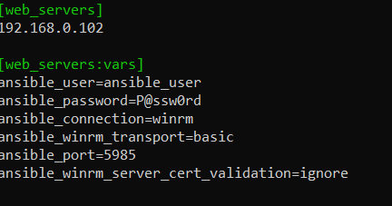
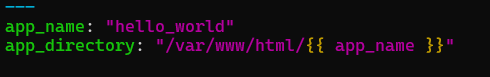
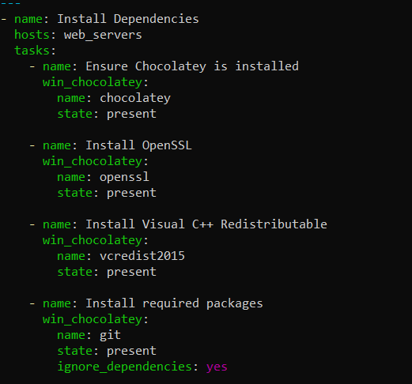
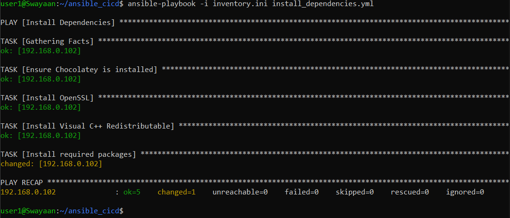
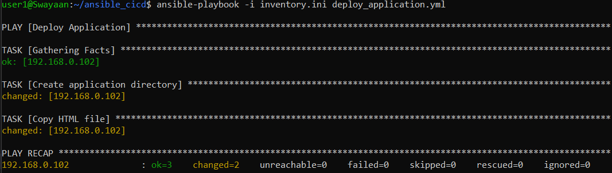
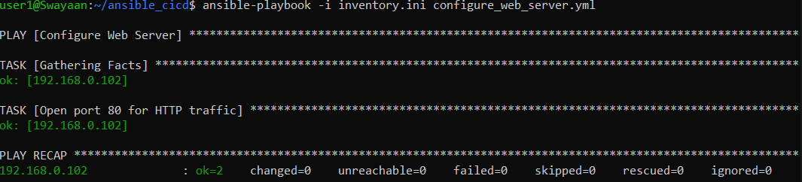
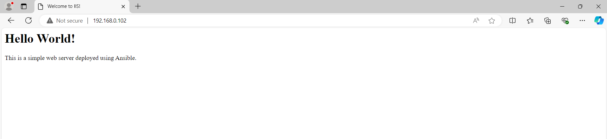

# Implementing a CI/CD Pipeline Using Ansible for Continuous Deployment

## Table of Contents

1. [Introduction](#introduction)
2. [Problem Statement](#problem-statement)
3. [Prerequisites](#prerequisites)
   - [Software Requirements](#software-requirements)
4. [Step-by-Step Guide to Implementing CI/CD with Ansible](#step-by-step-guide-to-implementing-cicd-with-ansible)
   - [Step 1: Set Up Inventory and Group Variables](#step-1-set-up-inventory-and-group-variables)
   - [Step 2: Create Playbooks for CI/CD Tasks](#step-2-create-playbooks-for-cicd-tasks)
     - [Task 1: Install Dependencies](#task-1-install-dependencies)
     - [Task 2: Deploy Application](#task-2-deploy-application)
     - [Task 3: Configure Web Server](#task-3-configure-web-server)
   - [Step 3: Run the CI/CD Pipeline](#step-3-run-the-cicd-pipeline)
5. [Verifying the Deployment](#verifying-the-deployment)
6. [Supported References](#supported-references)

---

## Introduction

In modern software development, Continuous Integration and Continuous Deployment (CI/CD) pipelines automate the process of deploying applications. This guide demonstrates how to implement a CI/CD pipeline using Ansible, leveraging its capabilities to automate tasks across multiple environments.

---

## Problem Statement

Manually deploying applications can be error-prone and time-consuming. A well-defined CI/CD pipeline allows for consistent deployments, faster release cycles, and automated testing, ensuring that applications are always in a deployable state.

---

## Prerequisites
Completion of all previous lab guides (up to Lab Guide-09) is required before proceeding with Lab Guide-10.

### Software Requirements
- **Ansible 2.9+**: Installed on your control node (WSL for Windows users).
- **WSL (Windows Subsystem for Linux)**: If using Windows as your control node.
- **Access to a Web Server**: This can be a local machine or a remote server.
- **Git**: If using a Git repository for the application code.

---

## Step-by-Step Guide to Implementing CI/CD with Ansible

### Step 1: Set Up Inventory and Group Variables

1. **Create Playbook Directory**:
   - Create a directory for your playbooks:

   ```bash
   mkdir ~/ansible_cicd
   cd ~/ansible_cicd
   ```

2. **Create Inventory File**:

   - Create a file named `inventory.ini`:

   ```bash
   nano inventory.ini
   ```

   ```ini
   [web_servers]
   <ip-address>
   
   [web_servers:vars]
   ansible_user=ansible_user 
   ansible_password=P@ssw0rd 
   ansible_connection=winrm 
   ansible_winrm_transport=basic 
   ansible_port=5985
   ansible_winrm_server_cert_validation=ignore
   ```

   

3. **Create Group Variables**:

   - Create a directory for group variables and add a file named `group_vars/web_servers.yml`:

   ```mkdir
   mkdir group_vars
   ```

   ```bash
   nano group_vars/web_servers.yml
   ```

   ```yaml
   ---
   app_name: "hello_world"
   app_directory: "/var/www/html/{{ app_name }}"
   ```

   

### Step 2: Create Playbooks for CI/CD Tasks

1. **Create `install_dependencies.yml` Playbook**:

   ```yaml
   ---
   - name: Install Dependencies
     hosts: web_servers
     tasks:
       - name: Ensure Chocolatey is installed
         win_chocolatey:
           name: chocolatey
           state: present
   
       - name: Install OpenSSL
         win_chocolatey:
           name: openssl
           state: present
   
       - name: Install Visual C++ Redistributable
         win_chocolatey:
           name: vcredist2015
           state: present
   
       - name: Install required packages
         win_chocolatey:
           name: git
           state: present
           ignore_dependencies: yes
   ```

   

2. **Create `deploy_application.yml` Playbook**:

   ```yaml
   ---
   - name: Deploy Application
     hosts: web_servers
     tasks:
       - name: Create application directory
         win_file:
           path: "{{ app_directory }}"
           state: directory

       - name: Copy HTML file
         win_copy:
           content: "<html><body><h1>Hello World!</h1></body></html>"
           dest: "{{ app_directory }}/index.html"
   ```

3. **Create `configure_web_server.yml` Playbook**:

   ```yaml
   ---
   - name: Configure Web Server
     hosts: web_servers
     tasks:
       - name: Open port 80 for HTTP traffic
         win_firewall_rule:
           name: "Allow HTTP"
           enable: yes
           localport: '80'
           protocol: TCP
           action: allow
           direction: in
   ```

### Step 3: Run the CI/CD Pipeline

1. **Execute the Playbooks**:
   - Run the playbooks in order to set up the CI/CD pipeline:

   ```bash
   ansible-playbook -i inventory.ini install_dependencies.yml
   ansible-playbook -i inventory.ini deploy_application.yml
   ansible-playbook -i inventory.ini configure_web_server.yml
   ```

   

   

   

---

## Verifying the Deployment

1. **Access the Application**:
   - Open a web browser and navigate to the server's IP address:

   ```bash
   http://<ip-address>
   ```

   

   You should see a "Hello World!" message if the deployment was successful.

---

## Supported References

- [Ansible Documentation](https://docs.ansible.com/ansible/latest/index.html)
- [Continuous Integration and Continuous Deployment](https://www.atlassian.com/continuous-delivery)
- [Ansible Galaxy](https://galaxy.ansible.com/)

---